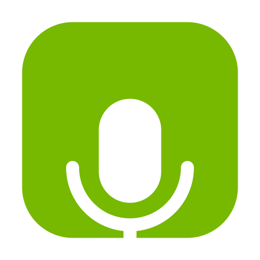

<div align="center">



# Söyle

**Dis-le. Et c'est écrit.**

Dictée vocale **push-to-talk, 100 % locale** sur Apple Silicon.
Maintiens une touche, parle, relâche — le texte est transcrit sur ta machine et copié,
prêt à coller partout. Propulsé par **NVIDIA Nemotron 3.5 ASR** via **MLX**.


</div>

---

## Pourquoi Söyle

- 🔒 **Local & privé** — aucun octet d'audio ne quitte ta machine. Pas de cloud, pas d'abonnement.
- 🌍 **40 langues** depuis un seul modèle (FR / EN / TR / DE / ES…), ponctuation + majuscules automatiques.
- ⚡ **Rapide** — ~30–40× le temps réel sur un MacBook Air M4 (8-bit).
- 🎯 **Simple** — un défaut sensé pour tout le monde ; tout est réglable pour qui veut.
- 🟢 **Open-source** (MIT).

## Comment ça marche

1. Söyle vit dans la barre de menus (pas d'icône dans le Dock).
2. **Maintiens** la touche push-to-talk (Option droite ⌥ par défaut) → enregistrement.
3. **Parle.**
4. **Relâche** → transcription locale en quelques dixièmes de seconde → **texte copié** dans le presse-papier.
5. **Colle** (⌘V) où tu veux.

Une pilule flottante (vert NVIDIA) montre l'état : enregistrement → transcription → copié ✓.

## Installation

> Distribution open-source signée ad-hoc (sans compte Apple Developer). Au premier lancement,
> macOS affiche un avertissement Gatekeeper : **Réglages Système → Confidentialité et sécurité → Ouvrir quand même**.

### Compiler depuis les sources

```bash
git clone https://github.com/hasso5703/soyle.git
cd soyle
scripts/build_app.sh Release
open dist/Söyle.app
```

Requiert Xcode 16+ (le compilateur Metal en a besoin — voir [BUILDING.md](BUILDING.md)).
Le modèle (~756 Mo) se télécharge au premier lancement.

## Permissions (2)

| Permission | Pourquoi | Où |
|---|---|---|
| **Microphone** | Enregistrer ta voix | demandé au 1er lancement |
| **Surveillance des saisies** | Détecter ta touche globalement (push-to-talk) | Réglages → Confidentialité → Surveillance des saisies → relancer |

Pas d'Accessibilité requise : Söyle **copie** le texte (tu colles avec ⌘V).

## Réglages

Accessibles via la barre de menus → **Réglages…** :

- **Touche push-to-talk** : Option droite (défaut), Option gauche, Contrôle droit, ou Fn / 🌐.
- **Langue** : Auto (détection) ou une locale fixe (fr-FR, en-US, tr-TR…).
- **Modèle** : **8-bit** (défaut, rapide) ou **bf16** (précision max).
- Sons de retour, lancement au démarrage.

## Pile technique

| Brique | Rôle |
|---|---|
| [NVIDIA Nemotron 3.5 ASR](https://huggingface.co/nvidia/nemotron-3.5-asr-streaming-0.6b) | modèle (cache-aware FastConformer-RNNT, 600M, 40 locales) |
| [mlx-audio-swift](https://github.com/Blaizzy/mlx-audio-swift) | implémentation Swift/MLX native de Nemotron (MIT) |
| [mlx-community](https://huggingface.co/mlx-community) | poids convertis MLX (8-bit / bf16) |
| [MLX](https://github.com/ml-explore/mlx-swift) | calcul sur Apple Silicon (Apple) |

100 % Swift natif — pas de Python à l'exécution.

## Feuille de route

- [ ] Texte en direct pendant la dictée (streaming `generateStream`)
- [ ] DMG notarisé + cask Homebrew (`brew install --cask soyle`)
- [ ] Dictionnaire perso (noms propres, jargon)
- [ ] Raccourci « mode mains libres » (toggle)

## Crédits & licence

Construit sur le travail de Prince Canuma (mlx-audio-swift) et NVIDIA (Nemotron).
Code Söyle sous licence [MIT](LICENSE).
