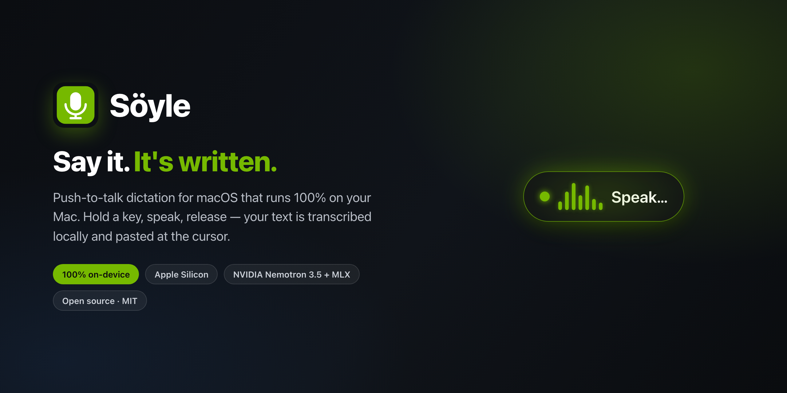
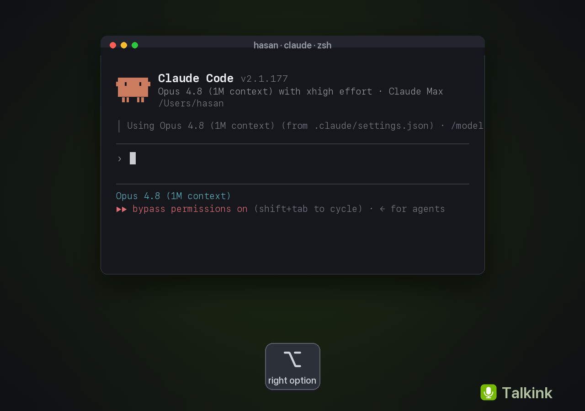
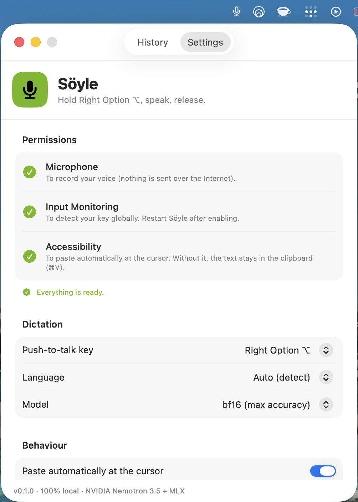
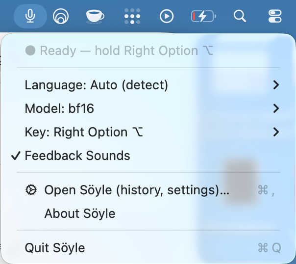
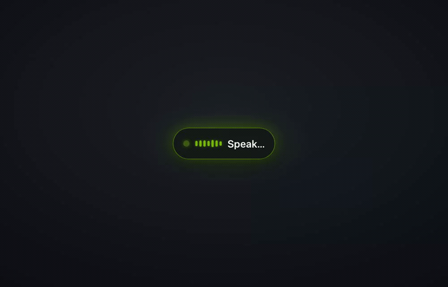

<div align="center">



# Söyle

Push-to-talk dictation for macOS, **100% on-device**. Hold a key, speak, release —
your text is transcribed locally and pasted right at your cursor. Powered by
**NVIDIA Nemotron 3.5 ASR** via **MLX**.


<br/>



</div>

---

## Why Söyle

- 🔒 **Local & private** — your voice and text never leave your Mac. No cloud, no subscription.
- ⚡ **Fast** — ~30–40× faster than real time on a MacBook Air M4 (8-bit model).
- 🌍 **Multilingual** — auto-detects across the model's ~40 locales; 9 fixed locales selectable (EN/FR/DE/ES/IT/PT/TR/AR/NL). Punctuation & capitalization included.
- ⌨️ **Paste anywhere** — auto-pastes at the cursor; always on the clipboard as a fallback.
- 📜 **History** — every transcription is kept locally and is searchable / re-copyable in-app.
- 🟢 **Open source** (MIT), 100% native Swift — no Python at runtime.

## How it works

1. Söyle lives in the menu bar (no Dock icon).
2. **Hold** the push-to-talk key (Right Option ⌥ by default) → recording starts.
3. **Speak.**
4. **Release** → local transcription in a fraction of a second → text is **pasted at your cursor** (if Accessibility is granted) and **copied to the clipboard**.
5. It's also saved to **History** in case you need it again.

A floating pill (NVIDIA green) shows the state: recording → transcribing → done.

## Screenshots

<p align="center">
  
  &nbsp;&nbsp;
  
</p>

<p align="center"><i>The recording pill, reacting to your voice:</i></p>
<p align="center"></p>

## Install

**Requirements:** Apple Silicon Mac (M1–M4), macOS 14 or later.

Söyle is open source and **not notarized by Apple** (notarization costs $99/yr — see
[Is it safe?](#is-it-safe) below). Because of that, macOS shows a one-time security warning
on first launch. Here's the complete, beginner-friendly walkthrough.

### 1. Download

On the [**latest release**](https://github.com/hasso5703/soyle/releases/latest) page, under
**Assets**, download **`Soyle.zip`** with your browser.

### 2. Move it to Applications

Double-click `Soyle.zip` to unzip it, then drag **`Söyle.app`** into your **Applications** folder.

### 3. Open it the first time (get past Gatekeeper)

Because the app isn't notarized, macOS blocks the first launch (*"Söyle can't be opened…"*).
Choose **one** of these — you only do it once:

**Option A — Terminal (one line, easiest):**
```bash
xattr -dr com.apple.quarantine /Applications/Söyle.app && open /Applications/Söyle.app
```

**Option B — No terminal:** double-click **Söyle**, click **Done** on the warning, then open
 → **System Settings → Privacy & Security**, scroll to *"Söyle was blocked…"*, click
**Open Anyway**, and confirm with Touch ID / your password.

> <a name="is-it-safe"></a>**Is it safe?** Yes. Söyle is fully open source — you can read every
> line in this repo and [build it yourself](BUILDING.md). The warning only means Apple hasn't been
> paid to notarize the download; it says nothing about what the app does. Clearing the quarantine
> flag is the standard step for any open-source Mac app distributed outside the App Store.

### 4. Grant permissions (the onboarding window guides you)

| Permission | Why | Note |
|---|---|---|
| **Microphone** | To hear you | — |
| **Input Monitoring** | Detect the push-to-talk key everywhere | **Relaunch Söyle after enabling** (macOS requires it) |
| **Accessibility** *(optional)* | Paste at the cursor | Skip it and Söyle just copies to the clipboard (paste with ⌘V) |

### 5. Use it

On the **first** transcription, Söyle downloads the model (~756 MB) once — you'll see
*"Loading model…"*. After that: **hold Right Option ⌥, speak, release** → your text appears at
the cursor and on the clipboard. That's it. 🎤

---

### Build from source (developers)

```bash
git clone https://github.com/hasso5703/soyle.git
cd soyle
scripts/build_app.sh Release
open dist/Söyle.app
```

Requires **full Xcode 16+** (the Metal compiler is needed — see [BUILDING.md](BUILDING.md)).
A locally built app runs without the Gatekeeper step above.

## Settings

Menu bar → **Open Söyle** → *Settings* tab:

- **Push-to-talk key** — Right Option (default), Left Option, Right Control, or Fn / 🌐.
- **Language** — Auto (detect) or a fixed locale.
- **Model** — **8-bit** (default, fast) or **bf16** (max accuracy).
- **Auto-paste at cursor**, feedback sounds, launch at login, check for updates.

## Network activity

Söyle's transcription is 100% on-device. The only network calls are:

1. **First-run model download** (~756 MB) from Hugging Face into `~/.cache/huggingface`.
2. **Update check** (optional, toggle in Settings) — a request to the GitHub Releases API at launch. No usage telemetry is sent.

## Troubleshooting

- **Push-to-talk does nothing** → grant **Input Monitoring** (System Settings → Privacy & Security → Input Monitoring), then **relaunch** Söyle (the grant only applies after relaunch).
- **It stopped working after rebuilding from source** → ad-hoc signatures change each build; run `scripts/dev_sign_setup.sh` once to create a stable local signing identity so grants persist.
- **Using Fn / 🌐 as the key** → set System Settings → Keyboard → "Press 🌐 to" = **Do Nothing**.
- **Model download stalls** → check your connection and `~/.cache/huggingface`.

## Tech stack & credits

| Component | Role | License |
|---|---|---|
| [NVIDIA Nemotron 3.5 ASR](https://huggingface.co/nvidia/nemotron-3.5-asr-streaming-0.6b) | The model (cache-aware FastConformer-RNNT, 600M, ~40 locales) | NVIDIA model license (OpenMDW-1.1) — see model card |
| [mlx-audio-swift](https://github.com/Blaizzy/mlx-audio-swift) | Native Swift/MLX implementation of Nemotron (Prince Canuma) | MIT |
| [mlx-community](https://huggingface.co/mlx-community) | MLX-converted weights (8-bit / bf16) | per model license |
| [MLX](https://github.com/ml-explore/mlx-swift) | Compute on Apple Silicon (Apple) | MIT |

**The downloaded model is governed by NVIDIA's model license, not MIT.** By using Söyle you agree to it.

## Roadmap

- [ ] Live text while you speak (streaming `generateStream`)
- [ ] Notarized DMG + [Sparkle](https://sparkle-project.org) auto-update + Homebrew cask
- [ ] Custom dictionary (proper nouns, jargon)
- [ ] Hands-free toggle mode

## License

Söyle's code is [MIT](LICENSE). See the table above for component and model licenses.
